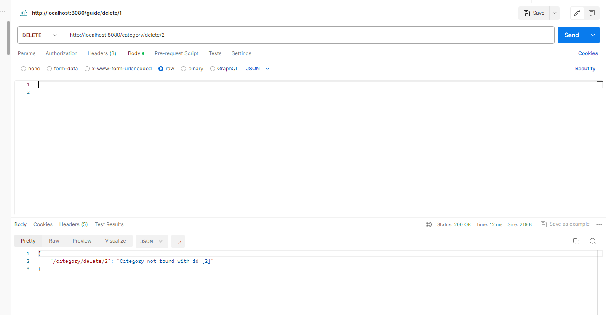
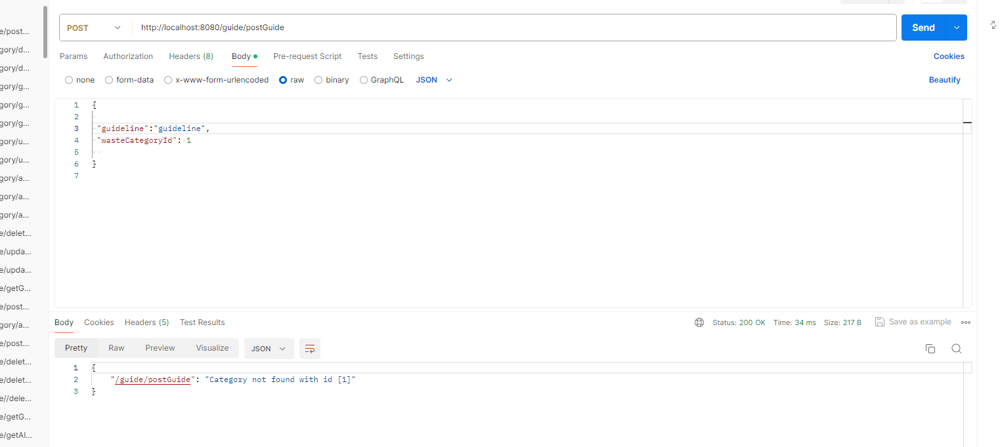

## Waste sorting mobile application
The purpose of this program is to structure entities for the waste sorting mobile application in Java Spring Boot, begin by identifying core entities like Waste Category, Disposal Guideline, and Recycling Tip. Create corresponding Java classes to represent these entities, including fields for their attributes. Establish any necessary relationships between entities, such as a Waste Category having associated disposal guidelines. Then, create repository interfaces to handle CRUD operations and service classes to encapsulate business logic. Design REST endpoints in controller classes, specifying URIs, request methods, payloads, and error handling mechanisms. Finally, ensure input validation using Spring Boot validation annotations to maintain data integrity and validity. This approach facilitates the development of a robust and efficient backend system for the application, enabling seamless data exchange between the frontend and backend components.

## Endpoints for category
### add category input validation
1. http://localhost:8080/category/addCategory
- Method: POST
- Description: Upload category with empty input
- Response: field must not be blank
- Status Code: 400 Bad Request
  

### add category
1. http://localhost:8080/category/addCategory
- Method: POST
- Description: Uploading a category
- Response: JSON object
- Status Code: 200 OK

### update category

1. http://localhost:8080/category/updateCategory/{id}
- Method: POST
- Description: update
- Response: JSON object
- Status Code: 200 OK

### Error handling
1. http://localhost:8080/category/updateCategory/{id}
- Method: POST
- Description: update a category that does not exist it will throw an exception
  

### Get all categories

1. http://localhost:8080/category/getAllCategories
- Method: GET
- Description: get all categories
- Response: Array of objects
- Status Code: 200 OK
  

### Get category by Id

1. http://localhost:8080/category/getCategory/{id}
- Method: GET
- Description: get category by Id
- Response: JSON object
- Status Code: 200 OK
  

### Delete Category

1. http://localhost:8080/category/delete/{id}
- Method: DELETE
- Description: Get category by Id that does not exist it will throw an exception
- Response: Successfully deleted catehory
- Status Code: 200 OK
  

### Error handling
1. http://localhost:8080/category/delete/{id}
- Method: DELETE
- Description: delete a category that does not exist it will throw an exception
  

## Endpoints for guidelines

### add guide
1. http://localhost:8080/guide/addCategory
- Method: POST
- Description: Upload
- Response: JSON
- Status Code: 200 OK
  

### Error handling
1. http://localhost:8080/guide/addCategory
- Method: POST
- Description: add a guideline with category id that does not exist it will throw an exception
  

### update guideline

1. http://localhost:8080/guide/updateDisposal/{id}
- Method: POST
- Description: update guideline
- Response: JSON object
- Status Code: 200 OK
  

### Error handling
1. http://localhost:8080/guide/updateDisposal/{id}
- Method: POST
- Description: update a guideline that does not exist it will throw an exception
  

### Get all guideline

1. http://localhost:8080/guide/getAllGuides
- Method: GET
- Description: get all guidelines
- Response: Array of guidelines objects
- Status Code: 200 OK
  

### Get guideline by Id

1. http://localhost:8080/guide/getGuide/{id}
- Method: GET
- Description: get guideline by Id
- Response: JSON object
- Status Code: 200 OK
  

### Error handling
1. http://localhost:8080/guide/getGuide/{id}
- Method: POST
- Description: get guideline that does not exist it will throw an exception
  

### Delete guideline

1. http://localhost:8080/guide/delete/{id}
- Method: DELETE
- Description: delete guide by Id
- Response: Disposal guide successfully deleted
- Status Code: 200 OK
  

### Error handling
1. http://localhost:8080/guide/delete/{id}
- Method: DELETE
- Description: delete a guideline that does not exist it will throw an exception
  

## Endpoints for recycling tips

### add recycling tip
1. http://localhost:8080/tips/addRecyclingTip
- Method: POST
- Description: Upload recycling tip
- Response: JSON object
- Status Code: 200 OK
  

### Error handling
1. http://localhost:8080/tips/addRecyclingTip
- Method: POST
- Description: add a recycling tip with category id that does not exist it will throw an exception
  

### update recycling tip

1. http://localhost:8080/tips/updateTip/{id}
- Method: POST
- Description: update recycling tips
- Response: JSON object
- Status Code: 200 OK
  

### Error handling
1. http://localhost:8080/tips/updateTip/{id}
- Method: POST
- Description: update a recycling tip that does not exist it will throw an exception
  

### Get all recycling tips

1. http://localhost:8080/tips/getAllTips
- Method: GET
- Description: get all recycling tips
- Response: Array of objects
- Status Code: 200 OK
  

### Get tip by Id

1. http://localhost:8080/tips/getTip/{id}
- Method: GET
- Description: get recycling tip by Id
- Response: JSON object
- Status Code: 200 OK
  

- ### Error handling
1. http://localhost:8080/tips/getTip/{id}
- Method: GET
- Description: getting recycling tip that does not exist it will throw an exception
  

### Delete recycling tip

1. http://localhost:8080/tips/deleteTip/{id}
- Method: DELETE
- Description: delete tip by Id
- Response: Tip successfully deleted 
- Status Code: 200 OK
  

### Error handling
1. http://localhost:8080/category/deleteTip/{id}
- Method: DELETE
- Description: deleting recycling tip that does not exist it will throw an exception
  